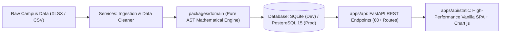

# CampusPulse — Enterprise Student Success & Placement Readiness OS

> **Smart Campus Analytics — Predict, Optimize & Improve Student Success**  
> Explainable, CI-audited, deterministic placement-readiness and student-success operating system for colleges.  
> Built for the **KPMG in India Hackathon (v5.0.0-FINAL)**.

---

## 🎯 Positioning & Purpose

CampusPulse is a **support tool, not a surveillance tool**. Higher education institutions frequently struggle with fragmented data silos across LMS logs, attendance systems, coding assessment platforms, and placement cells. 

CampusPulse consolidates these disparate campus signals into an auditable, deterministic **Student Success Score** and presents a prioritized, humane **Advisor Action List**. This enables faculty advisors and department leadership to transition from passive dashboard observation to proactive, closed-loop student support in **under 30 seconds per student**.

### Non-Goals
- ❌ Ranking students publicly or displaying shaming leaderboards.
- ❌ Making irreversible academic or placement determinations from a single assessment.
- ❌ Comparing colleges against each other unfairly.
- ❌ Exposing personally identifiable information (PII) beyond scoped faculty advisors.
- ❌ Relying on opaque, black-box LLMs or non-deterministic runtime APIs to calculate student scores.

---

## 🧩 KPMG Challenge Problem Mapping

| KPMG Challenge Requirement | CampusPulse Solution & Evidence |
| :--- | :--- |
| **Data Integration & Analysis (30%)** | Automated ingestion pipeline with multi-format support (CSV/XLSX), outlier winsorization, missing-data imputation, SHA-256 deduplication, and 4-week historical telemetry across 119 seeded students and 825 metric snapshots. |
| **Success Score & Risk Identification (25%)** | Deterministic 6-indicator formula ($S \in [0, 100]$), 3 fail-safe hard safety floors, review bands, 3-week EWMA momentum tracking, and 6 rule-based hidden risk detectors. |
| **Dashboard & Visualization (25%)** | Single Page Application featuring an Advisor Action List, Student 360 profile, waterfall point attribution, 2D quadrant scatter matrix, 9-tab college telemetry suite, and what-if simulation sandbox. |
| **Problem Understanding (10%)** | Advisor-first, humane decision support architecture designed for actionability, closed-loop intervention lifecycle tracking, and zero punitive labeling. |
| **Presentation & Demo (10%)** | Embedded 16:9 interactive presentation deck (7 slides with timer controls and presenter notes) and sub-60-second advisor triage workflow. |

---

## 🏗️ System Architecture & Technology Stack



### Technology Stack
- **Backend Framework**: [FastAPI](https://fastapi.tiangolo.com/) (Python 3.11+) with async lifespan lifecycle management, strict Pydantic v2 schemas, and standardized `{ data, meta }` response envelopes.
- **Frontend Architecture**: Zero-build, lightweight Single Page Application (HTML5, Vanilla CSS, Modern JavaScript) served directly by FastAPI at `/`, eliminating Node.js runtime overhead.
- **Data Visualization**: [Chart.js 4.4](https://www.chartjs.org/) for responsive 2D quadrant scatter matrix, waterfall attribution graphs, and multi-week metric trajectories.
- **Domain Engine**: Pure Python AST mathematical scoring engine (`packages/domain/`) with zero external network or LLM dependencies.
- **Database & ORM**: [SQLAlchemy 2.0](https://www.sqlalchemy.org/) ORM with dual engine support:
  - Development / Demo: Pre-seeded local SQLite (`campuspulse_local.db`).
  - Production: PostgreSQL 15+ via asyncpg connection pooling.
- **Deployment Platform**: [Render](https://render.com) Web Service configured via `render.yaml` and `requirements.txt`.

---

## 📐 Student Success Score Formulation

The composite **Student Success Score** ($S \in [0, 100]$) is computed deterministically from six indicators:

$$S = 0.25(I_{\text{acad}}) + 0.20(I_{\text{att}}) + 0.20(I_{\text{place}}) + 0.15(I_{\text{lms}}) + 0.10(I_{\text{eng}}) + 0.10(I_{\text{skills}})$$

### Indicator Definitions

| Indicator | Weight | Mathematical Formulation | Rationale |
| :--- | :---: | :--- | :--- |
| **Academic** ($I_{\text{acad}}$) | **25%** | $\text{clamp}(\text{CGPA} \times 10 - 3 \times \min(\text{backlogs}, 5), 0, 100)$ | Core academic baseline penalized for active backlog drag. |
| **Attendance** ($I_{\text{att}}$) | **20%** | $\text{clamp}(\mu_{\text{att}} - 5 \times N_{\text{sub} < 60\%}, 0, 100)$ | Penalizes localized subject absenteeism even if overall attendance seems acceptable. |
| **Placement** ($I_{\text{place}}$) | **20%** | $0.35 \cdot \text{Aptitude} + 0.40 \cdot \text{Coding} + 0.25 \cdot \text{MockInterview}$ | Direct placement readiness signal. Fallback to assessment sub-score when coding logs are absent. |
| **LMS Engagement** ($I_{\text{lms}}$) | **15%** | $0.50 \cdot \text{CompletionPct} + 0.50 \cdot \text{ScaledLogins}$ | Measures self-directed continuous learning habits. |
| **Campus Engagement** ($I_{\text{eng}}$) | **10%** | $\text{clamp}\left(\frac{\text{WinsorizedSum}(\text{events}, \text{clubs}, \text{hackathons}, \text{certs})}{20} \times 100, 0, 100\right)$ | Extracurricular differentiation winsorized at 95th percentile to prevent extreme outlier skew. |
| **Skills Profile** ($I_{\text{skills}}$) | **10%** | $0.60 \cdot \text{TechnicalAssessment} + 0.40 \cdot \text{SoftSkills}$ | Balanced technical competency and interpersonal readiness. |

> **Mathematical Invariant**: Weights strictly sum to $1.0000000000$. Validated cryptographically at startup by `scripts/boot_check.py`.

---

## 🛡️ Fail-Safe Hard Safety Floors & Tiers

To ensure vulnerable students are never masked by high aggregate scores in other dimensions, the platform evaluates strict hard-floor safety triggers before ordinary tiering:

1. **Hard Floor Trigger (Top-Priority Override)**:
   $$\text{Attendance} < 57\% \quad \lor \quad \text{CGPA} < 4.7 \quad \lor \quad \text{Backlogs} \ge 3 \implies \mathbf{Priority\ Support\ [PINNED]}$$
   Students triggering a hard floor are automatically pinned to the top of the Advisor Action List.
2. **Review Band (Borderline Triage)**:
   $$57\% \le \text{Attendance} \le 63\% \quad \lor \quad 4.7 \le \text{CGPA} \le 5.3 \implies \mathbf{Review}$$
3. **Standard Score Bands**:
   - **On Track**: $\text{Score} \ge 60$
   - **Watchlist**: $40 \le \text{Score} < 60$
   - **Priority Support**: $\text{Score} < 40$

---

## 📊 2D Student Segmentation Matrix

Students are classified into **five mutually exclusive segments** to drive targeted intervention playbooks:

1. **Struggling on All Fronts**: Tier = `priority_support` with $\ge 4$ sub-indices below cohort $p_{25}$.
2. **Academic Stars with Placement Gap**: High academic performance ($I_{\text{acad}} \ge 75$) but low coding/placement readiness ($I_{\text{place}} \le p_{25}$).
3. **Hustlers at Academic Risk**: High extracurricular engagement ($I_{\text{eng}} \ge 75$) but academic index falling below cohort quartile ($I_{\text{acad}} < p_{25}$).
4. **Quietly Disengaged**: Adequate attendance ($I_{\text{att}} \ge 60\%$) but stagnant LMS and campus participation ($I_{\text{lms}}, I_{\text{eng}} < p_{25}$).
5. **Balanced Performers**: Consistent progression fulfilling institutional milestones across all dimensions.

---

## 🔍 Explainability & What-If Decision Intelligence

- **Waterfall Point Attribution**: Every student score card breaks down the exact positive points gained and negative penalties incurred by each indicator (e.g., $+18.2$ from Academics, $-6.0$ from Backlog Penalty).
- **Interactive What-If Simulation (`POST /api/v1/what-if`)**: Faculty advisors can simulate potential score improvements (e.g., "What if attendance increases from 58% to 75%?" or "What if coding score improves by 15 points?") in memory before assigning resources, without altering persistent records.

---

## 🔄 Closed-Loop Intervention Operating System

CampusPulse moves beyond diagnostic dashboards to closed-loop action:

1. **Detect**: System identifies risk drivers and hard-floor triggers.
2. **Prioritize**: Advisor Action List ranks students by an urgency formula combining severity, actionability, and trajectory momentum.
3. **Assign**: Advisor logs targeted interventions (e.g., *Coding Clinic*, *Attendance Review*, *Placement Mentoring*) with structured notes and target completion dates.
4. **Measure**: Status workflow (`OPEN` $\rightarrow$ `IN_PROGRESS` $\rightarrow$ `COMPLETED`) tracks completion and measures quantitative pre- vs. post-intervention trajectory.

---

## 🤖 ML/AI Philosophy & Governance (G1–G8)

### "Where is the AI?"
CampusPulse deliberately maintains an **AST-pure, deterministic mathematical core** for student scoring. Generative AI or black-box models are **never permitted** to make opaque, un-auditable classification decisions about students.

Machine Learning operates as an **advisory intelligence and disagreement layer**:
- **Model Registry (`/api/v1/ml/models`)**: Random Forest, Gradient Boosting, and Logistic Regression baselines trained to identify non-linear risk patterns.
- **Feature Importance (`/api/v1/ml/feature-importance`)**: Transparent feature ranking validating domain weights against empirical data.
- **Fairness & Agreement Audit (`/api/v1/ml/evaluation`)**: Audits proxy bias across departments and checks model agreement against deterministic rules.
- **Guardrails G1–G8**: Enforced programmatically. ML outputs never override deterministic tiers, segments, or hard safety floors.

---

## 🚀 Getting Started Locally

### 1. Prerequisites
- **Python**: 3.11+
- **Database**: SQLite (included out-of-the-box) or PostgreSQL 15+

### 2. Setup Environment
```bash
# Clone repository
git clone https://github.com/bhavyaanand2101-coder/BYTEXL_HACKATHON_2026_OCT.git
cd BYTEXL_HACKATHON_2026_OCT

# Copy environment configuration
cp .env.example .env
```

### 3. Install Dependencies
```bash
pip install -r requirements.txt
```

### 4. Run Pre-Flight Boot Validation
```bash
python scripts/boot_check.py
```

### 5. Run Test Suite
```bash
pytest
```

### 6. Start the API & Frontend Server
```bash
uvicorn apps.api.main:app --reload --host 0.0.0.0 --port 8000
```
Open **`http://localhost:8000`** in your browser to access the full Single Page Application, Advisor Dashboard, 2D Scatter Matrix, and 16:9 Presentation Deck.

---

## 🧪 Testing & Quality Gates

The test suite enforces mathematical determinism, API contract compliance, and PII protection:

```bash
pytest -v
```

### Verification Checks
- **`tests/unit/test_boot_check.py`**: Cryptographic weight summation ($1.0000000000$) and configuration integrity.
- **`tests/unit/test_determinism.py`**: Asserts identical inputs produce bitwise identical scores.
- **`tests/unit/test_ai_execution_contract.py`**: AST-pure scan prohibiting runtime LLM or network imports in scoring paths.
- **`tests/api/test_pii_scope.py`**: Non-PII Prometheus metrics endpoint strictly masks names and roll numbers.
- **`tests/api/test_interventions.py`**: Validates closed-loop intervention lifecycle (Create, Update, List).

---

## ☁️ Deployment on Render

The repository includes a ready-to-deploy [render.yaml](file:///Users/bhavya/Desktop/Final_Hack/render.yaml) blueprint:

```yaml
services:
  - type: web
    name: campuspulse
    runtime: python
    buildCommand: pip install -r requirements.txt
    startCommand: uvicorn apps.api.main:app --host 0.0.0.0 --port $PORT
    envVars:
      - key: PYTHON_VERSION
        value: 3.11.9
      - key: DATABASE_URL
        value: sqlite:///./campuspulse_local.db
      - key: ENVIRONMENT
        value: production
```

---

## ⚖️ Ethical Safeguards & Limitations

- **Support, Not Punishment**: Risk indicators are signals for advisor coaching, never punitive disciplinary measures.
- **Transparent Attribution**: Every recommendation cites auditable indicators rather than automated decisions.
- **Scope Limitations**: The system evaluates campus engagement and readiness indicators within the collegiate context; it does not predict real-world lifetime career outcomes.
- **PII Scope Protection**: Sensitive personal attributes (socio-economic status, caste, religion, gender) are excluded from data ingestion.
