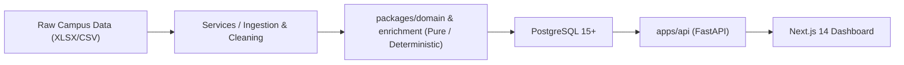

# CampusPulse

> **Smart Campus Analytics — Predict, Optimize & Improve Student Success**  
> Explainable, CI-audited, deterministic placement-readiness and student-success operating system for colleges.  
> Built for the **KPMG in India Hackathon (v5.0.0-FINAL)**.

---

## 🎯 Positioning & Purpose

CampusPulse is a **support tool, not a surveillance tool**. It turns fragmented campus signals (LMS logs, attendance, assessments, mock interviews, engagement, backlogs) into an explainable, deterministic **Student Success Score** and delivers a ranked, humane **Advisor Action List** so faculty can act on student success in under 30 seconds per student — not just watch it.

### Non-Goals
- ❌ Ranking students publicly or shaming them.
- ❌ Predicting real-world placement outcomes from a single assessment.
- ❌ Comparing colleges against each other.
- ❌ Exposing or selling PII (names/roll numbers strictly scoped).
- ❌ Using black-box LLMs to generate scores, tiers, or segments at runtime.

---

## 🏗️ Architecture & Philosophy



- **Deterministic Core**: All scoring formulas, tiers, and segments are pure mathematical functions. Zero nondeterminism in the score path.
- **AI Execution Contract**: AST-enforced in CI. Prohibits LLM/network imports in `packages/domain` and `services/enrichment`.
- **Explainable by Design**: Every score decomposes into exact contribution weights, raw inputs, and frozen human-readable templates.

---

## 🚀 Getting Started Locally

### 1. Prerequisites
- Python 3.11+
- Node.js 18+ (for frontend)
- Docker & Docker Compose (for local PostgreSQL 15)

### 2. Setup Environment
```bash
cp .env.example .env
# Edit .env to set your secret STUDENT_ID_SALT
```

### 3. Start Database
```bash
docker compose up -d postgres
```

### 4. Run Pre-Flight Boot Validation
```bash
python scripts/boot_check.py
```

### 5. Run Test Suite
```bash
pytest
```

### 6. Start API Server
```bash
uvicorn apps.api.main:app --reload --port 8000
```

---

## 📜 Audit & Verification Hashes
The system generates cryptographic SHA-256 fingerprints on startup:
- **`config_hash`**: `sha256(canonical_json(parsed_config_yaml + parsed_rules_yaml))[:16]`
- **`targets_hash`**: `sha256(canonical_json(parsed_TARGETS_yaml))[:16]`
